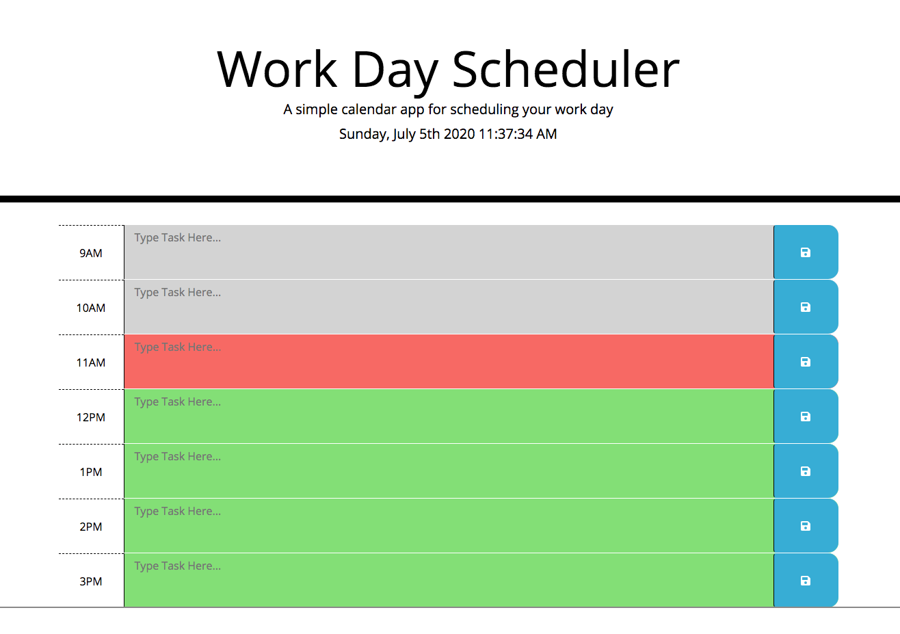
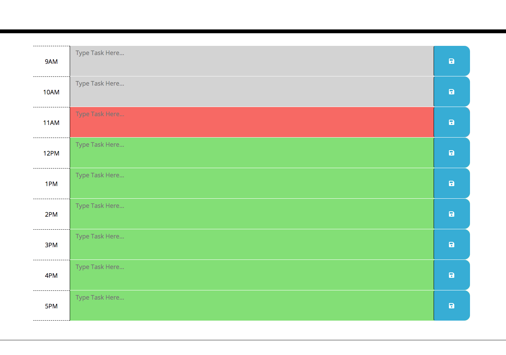

# Work Day Scheduler

## Purpose
A simple calendar app for scheduling your work day

* Day, date, year and time are presented at the top of the page including seconds counting
* One hour schedule blocks from 9am until 5pm
* Text area to enter and save tasks
* Saved tasks persist and are reloaded upon refresh
* Background color of each hour block changes based on future, present or past hours

## Built With
* HTML
* CSS
* Bootstap
* JavaScript
* jQuery
* Moment.js

## Website
https://taylornyquist.github.io/work-day-scheduler/

## Screen Shots and Video

https://drive.google.com/file/d/1c_43Wn4JL-7xlVcGkF2lBuPYSpz8BO1O/view

 ## Responsiveness
* Boostrap Grid
* Media Query at 768px

 ## Known Issues
* This application is only for one day of the week
* User must hit the save button, "enter" or clicking outside the text area don't save the task
* Hour isn't centered when in narrow view mode (<768px)

### Contribution
Made with ❤️  by Taylor Nyquist